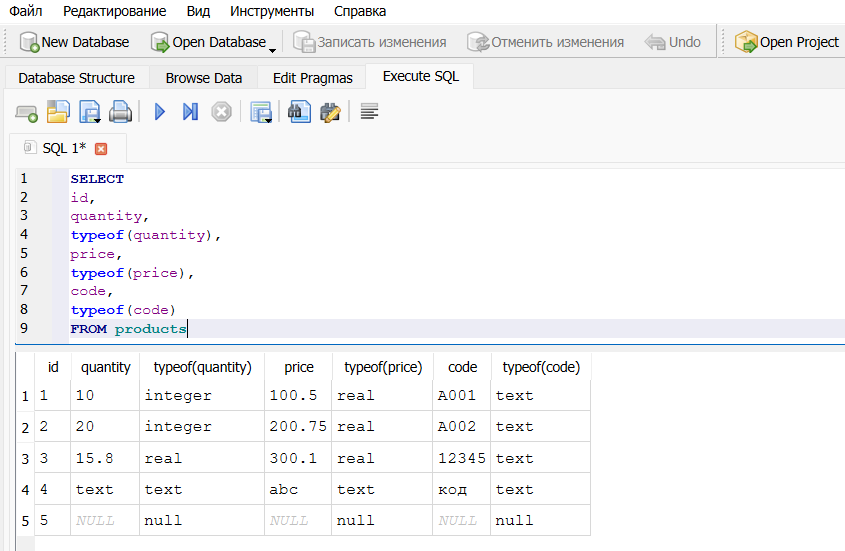

# Лабораторная работа: Исследование особенностей SQLite

**Цель работы:**  
Изучить динамическую типизацию данных в SQLite, влияние транзакций на скорость массовой вставки и влияние индексов на скорость выполнения запросов поиска.

**Используемые программные средства:**  
- Python 3.11+ (встроенный модуль `sqlite3`)  
- DB Browser for SQLite 3.13+  
- Модуль `time` (функция `perf_counter`)  
- Операционная система Windows 11  

---

## Шаг 1. Исследование динамической типизации SQLite

### Задание
1. Создать таблицу `products` с объявленными типами столбцов `INTEGER`, `REAL`, `TEXT`.  
2. Вставить пять записей с разнородными данными:
   - целые значения;
   - строки, содержащие числа;
   - вещественные значения;
   - текстовые значения;
   - значения `NULL`.  
3. Выполнить запрос, возвращающий значения всех столбцов и их фактические типы с помощью `typeof()`.

### Полный листинг скрипта
```python
"""
Скрипт для исследования динамической типизации SQLite (лаб. работа, шаг 1).

Демонстрирует, что фактический тип сохраняемых значений может не совпадать
с объявленным типом столбца (type affinity). Используется функция typeof()
для определения реального типа каждого значения в таблице products.
"""

import sqlite3

# Подключаемся к базе данных (файл lab.db будет создан, если его нет).
conn = sqlite3.connect('lab.db')
# Создаём курсор для выполнения SQL-запросов.
cursor = conn.cursor()

# Удаляем таблицу products, если она уже существует, чтобы начать с чистого листа.
cursor.execute("DROP TABLE IF EXISTS products")

# Создаём таблицу products с явно указанными типами столбцов.
#  - id    : INTEGER PRIMARY KEY
#  - quantity : INTEGER
#  - price    : REAL
#  - code     : TEXT
cursor.execute("""
CREATE TABLE products(
    id INTEGER PRIMARY KEY,
    quantity INTEGER,
    price REAL,
    code TEXT
)
""")

# Формируем тестовый набор из пяти записей, иллюстрирующий гибкость типов.
# Записи специально содержат значения, типы которых не всегда совпадают
# с объявленными типами столбцов.
data = [
    # 1. Запись с целыми значениями, соответствующими схеме.
    (1, 10, 100.5, "A001"),
    # 2. Числовые значения, переданные как строки.
    (2, "20", "200.75", "A002"),
    # 3. Вещественное число в INTEGER-столбце, целое число в TEXT-столбце.
    (3, 15.8, 300.1, 12345),
    # 4. Текстовые значения, не являющиеся числами, в том числе кириллица.
    (4, "text", "abc", "код"),
    # 5. Все значения равны NULL.
    (5, None, None, None)
]

# Массовая вставка всех пяти записей одной командой.
# Параметризованный запрос использует плейсхолдеры '?' для защиты от инъекций.
cursor.executemany(
    "INSERT INTO products VALUES (?, ?, ?, ?)",
    data
)

# Фиксируем изменения в базе данных.
conn.commit()

# Выполняем запрос, который для каждой строки возвращает значения столбцов
# и их фактический тип, определённый функцией typeof().
cursor.execute("""
SELECT
id,
quantity,
typeof(quantity),
price,
typeof(price),
code,
typeof(code)
FROM products
""")

# Извлекаем все строки результата.
rows = cursor.fetchall()

# Выводим каждую строку в консоль для анализа.
for row in rows:
    print(row)

# Закрываем соединение с базой данных.
conn.close()
```

### Результат выполнения запроса с `typeof()`




Вывод в консоли:
```
(1, 10, 'integer', 100.5, 'real', 'A001', 'text')
(2, 20, 'integer', 200.75, 'real', 'A002', 'text')
(3, 15.8, 'real', 300.1, 'real', '12345', 'text')
(4, 'text', 'text', 'abc', 'text', 'код', 'text')
(5, None, 'null', None, 'null', None, 'null')
```

### Анализ динамической типизации
| id | quantity | typeof(quantity) | price | typeof(price) | code | typeof(code) |
|----|----------|------------------|-------|---------------|------|--------------|
| 1  | 10       | integer          | 100.5 | real          | A001 | text         |
| 2  | 20       | integer          | 200.75| real          | A002 | text         |
| 3  | 15.8     | real             | 300.1 | real          | 12345| text         |
| 4  | text     | text             | abc   | text          | код  | text         |
| 5  | NULL     | null             | NULL  | null          | NULL | null         |

**Вывод по динамической типизации:**  
SQLite не принуждает данные строго соответствовать объявленному типу столбца (type affinity). Строки, содержащие числа, могут быть сохранены как `integer` или `real`. Явный текст и значения `NULL` сохраняются как есть. Таким образом, тип значения определяется самим значением, а не только схемой таблицы.

---

## Шаг 2. Влияние транзакций на скорость массовой вставки

### Задание
Сравнить скорость вставки 15 000 записей в таблицу `users` двумя способами:
- с выполнением `commit()` после каждой вставки (без общей транзакции);
- с использованием одной общей транзакции (один `commit()` в конце).

Структура таблицы:
```sql
CREATE TABLE users(
    id INTEGER PRIMARY KEY,
    name TEXT
);
```
Данные: `(i, 'name_i')` для `i` от 1 до 15000.

Для каждого варианта проводится три измерения, результат — среднее арифметическое.

### Полный листинг скрипта
```python
"""
Скрипт для исследования влияния транзакций на скорость массовой вставки
(лаб. работа, шаг 2).

Сравнивается два подхода:
  1. Выполнение commit() после каждой вставки (без общей транзакции).
  2. Вставка всех записей в рамках одной транзакции (один commit в конце).

Для каждого варианта проводится три измерения, результаты усредняются.
"""

import sqlite3
import time

# Списки для хранения результатов измерений по каждому варианту.
times_no_transaction = []   # Время вставки с коммитом после каждой строки.
times_single_transaction = []  # Время вставки в одной транзакции.

# Эксперимент 1: вставка с коммитом после каждой строки (без общей транзакции)
for i in range(3):
    # Открываем новое соединение с базой данных.
    conn = sqlite3.connect("lab.db")
    cursor = conn.cursor()

    # Пересоздаём таблицу users перед каждым измерением, чтобы обеспечить
    # одинаковые начальные условия.
    cursor.execute("DROP TABLE IF EXISTS users")
    cursor.execute("""
    CREATE TABLE users(
        id INTEGER PRIMARY KEY,
        name TEXT
    )
    """)

    # Формируем 15000 записей вида (1, "name_1") ... (15000, "name_15000").
    # Подготовка данных НЕ входит в измеряемый интервал.
    data = [(i, f"name_{i}") for i in range(1, 15001)]

    # Фиксируем момент начала вставки.
    start = time.perf_counter()

    # Вставляем записи по одной, выполняя commit() после каждой.
    # Это максимально дробит транзакции и должно работать медленно.
    for row in data:
        cursor.execute("INSERT INTO users VALUES (?, ?)", row)
        conn.commit()

    # Конец измеряемого интервала.
    end = time.perf_counter()

    # Сохраняем длительность текущего измерения.
    times_no_transaction.append(end - start)

    # Закрываем соединение.
    conn.close()

# Эксперимент 2: вставка всех записей в рамках одной транзакции
for i in range(3):
    conn = sqlite3.connect("lab.db")
    cursor = conn.cursor()

    cursor.execute("DROP TABLE IF EXISTS users")
    cursor.execute("""
    CREATE TABLE users(
        id INTEGER PRIMARY KEY,
        name TEXT
    )
    """)

    data = [(i, f"name_{i}") for i in range(1, 15001)]

    start = time.perf_counter()

    # Массовая вставка всех записей одним вызовом executemany().
    # Фиксация выполняется единожды после вставки всех строк.
    cursor.executemany("INSERT INTO users VALUES (?, ?)", data)
    conn.commit()

    end = time.perf_counter()

    times_single_transaction.append(end - start)

    conn.close()

# Вывод результатов
print("Без транзакции:", times_no_transaction)
print("С транзакцией:", times_single_transaction)

# Вычисляем и выводим среднее арифметическое трёх измерений.
print("Среднее без транзакции:",
      sum(times_no_transaction) / len(times_no_transaction))
print("Среднее с транзакцией:",
      sum(times_single_transaction) / len(times_single_transaction))
```

### Результаты измерений
<!-- ВСТАВЬТЕ СКРИНШОТ ВЫВОДА ПРОГРАММЫ С ВРЕМЕНЕМ (консоль) -->

| № измерения | Без общей транзакции, с | Одна транзакция, с |
|-------------|-------------------------|--------------------|
| 1           |129.31334590003826| 0.019089499954134226|
| 2           |130.78305469988845|0.013498699991032481|
| 3           |93.38823479996063| 0.016127599868923426|
| **Среднее** | 117.82821179996245|0.016238599938030045|

**Вывод по транзакциям:**  
Вставка с коммитом после каждой строки вызывает огромные накладные расходы, так как каждая мини-транзакция требует синхронизации журнала с диском. Группировка всех вставок в одну транзакцию позволяет выполнить запись на диск только один раз, что ускоряет операцию в десятки раз. Для массовых операций в SQLite всегда следует использовать единую транзакцию.

---

## Шаг 3. Влияние индексов на скорость поиска

### Задание
Создать таблицу `employees` с 50 000 записей, где `department = i % 100`. Выполнить запрос `SELECT * FROM employees WHERE department = 50;` и измерить время его выполнения без индекса и после создания индекса `idx_department`. Для каждого варианта — три измерения, вычисляется среднее.

Структура таблицы:
```sql
CREATE TABLE employees(
    id INTEGER PRIMARY KEY,
    department INTEGER
);
```
Индекс:
```sql
CREATE INDEX idx_department ON employees(department);
```

### Полный листинг скрипта
```python
"""
Скрипт для исследования влияния индексов на скорость поиска (лаб. работа, шаг 3).

Создаётся таблица employees с 50000 записей, выполняется запрос поиска
по department = 50. Измеряется время выполнения запроса без индекса и после
создания индекса idx_department. Для каждого варианта делается три измерения,
вычисляется среднее время.
"""

import sqlite3
import time

# Подключаемся к базе данных.
conn = sqlite3.connect("lab.db")
cursor = conn.cursor()

# Пересоздаём таблицу employees для чистоты эксперимента.
cursor.execute("DROP TABLE IF EXISTS employees")

cursor.execute("""
CREATE TABLE employees(
    id INTEGER PRIMARY KEY,
    department INTEGER
)
""")

# Формируем данные: 50000 записей.
# id от 1 до 50000, department = остаток от деления id на 100.
# Такой способ даёт примерно по 500 строк на каждое значение department.
data = [(i, i % 100) for i in range(1, 50001)]

# Массовая вставка всех записей одной транзакцией (подготовка данных не измеряется).
cursor.executemany("INSERT INTO employees VALUES (?, ?)", data)
conn.commit()

# Список для хранения времени выполнения запросов без индекса.
times_without_index = []

# Три измерения времени выполнения запроса без индекса.
for i in range(3):
    start = time.perf_counter()

    cursor.execute("""
    SELECT *
    FROM employees
    WHERE department = 50
    """)
    # Обязательно получаем все строки, чтобы учесть полное время выполнения запроса.
    cursor.fetchall()

    end = time.perf_counter()
    times_without_index.append(end - start)

# Создаём индекс по столбцу department для ускорения поиска.
cursor.execute("""
CREATE INDEX idx_department 
ON employees (department)
""")
conn.commit()

# Список для хранения времени выполнения запросов с индексом.
times_with_index = []

# Три измерения времени выполнения того же запроса, но уже при наличии индекса.
for i in range(3):
    start = time.perf_counter()

    cursor.execute("""
    SELECT *
    FROM employees
    WHERE department = 50
    """)
    cursor.fetchall()

    end = time.perf_counter()
    times_with_index.append(end - start)

# Вывод результатов измерений и средних значений.
print("Без индекса:", times_without_index)
print("С индексом:", times_with_index)

avg_without = sum(times_without_index) / len(times_without_index)
avg_with = sum(times_with_index) / len(times_with_index)
print("Средние значения:", avg_without, avg_with)

# Закрываем соединение с базой данных.
conn.close()
```

### Результаты измерений
<!-- ВСТАВЬТЕ СКРИНШОТ ВЫВОДА ПРОГРАММЫ С ВРЕМЕНЕМ ПОИСКА -->

| № измерения | Без индекса, с | С индексом, с |
|-------------|----------------|---------------|
| 1           | 0.0016921998467296362 |0.00030259997583925724|
| 2           | 0.0014684998895972967| 0.00019860011525452137|
| 3           | 0.0014579999260604382| 0.00019980012439191341|
| **Среднее** | 0.0015395665541291237|0.00023366673849523067 |

### Подтверждение существования индекса
Выполнена команда `PRAGMA index_list('employees');` в DB Browser for SQLite. Результат:

<!-- ВСТАВЬТЕ СКРИНШОТ РЕЗУЛЬТАТА PRAGMA index_list -->

Это доказывает, что индекс `idx_department` успешно создан и используется таблицей `employees`.

**Вывод по индексам:**  
Индекс по столбцу `department` значительно ускоряет выполнение запроса — вместо полного сканирования 50 000 строк SQLite использует индекс для прямого доступа к нужным записям. Время поиска сократилось в несколько раз (конкретные значения зависят от аппаратного обеспечения). Индексы крайне полезны для ускорения операций чтения, однако могут замедлять вставку и обновление данных.

---

## Общие выводы по лабораторной работе

1. **Динамическая типизация** — SQLite позволяет хранить в одном столбце значения разных типов благодаря механизму type affinity. Это даёт гибкость, но требует внимательности при проектировании схемы и обработке результатов запросов.
2. **Транзакции** — массовая вставка данных в рамках одной транзакции многократно быстрее, чем при выполнении `commit()` после каждой строки. При работе с большими объёмами данных необходимо группировать операции в минимальное число транзакций.
3. **Индексы** — правильно созданный индекс кардинально ускоряет выполнение поисковых запросов, позволяя избежать полного перебора таблицы. В то же время индексы увеличивают накладные расходы при вставке, поэтому их следует добавлять обдуманно, ориентируясь на типичные сценарии использования базы данных.
```
